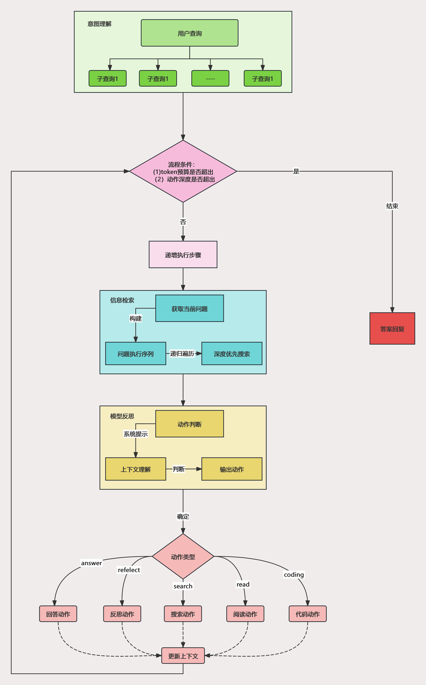

# TrustRAG：可靠输入与可信输出的RAG框架

可配置的模块化RAG框架。

\[ 中文| [English](README_zh) \]

[](https://www.python.org)

[](https://codecov.io/gh/gomate-community/TrustRAG)
[](http://www.pydocstyle.org/en/stable/)
[](https://www.python.org/dev/peps/pep-0008/)

## 🔥TrustRAG 简介

TrustRAG是一款配置化模块化的Retrieval-Augmented Generation (RAG) 框架，旨在提供**可靠的输入与可信的输出**
，确保用户在检索问答场景中能够获得高质量且可信赖的结果。

TrustRAG框架的设计核心在于其**高度的可配置性和模块化**，使得用户可以根据具体需求灵活调整和优化各个组件，以满足各种应用场景的要求。

## 🔨TrustRAG 框架

TrustRAG框架模块示意图如下


## DeepResearch功能

DeepResearch 框架通过分层查询、递归迭代以及智能决策等步骤，实现深度信息搜索和处理。本流程主要包含以下关键步骤：

1. 意图理解（Intent Understanding）
用户输入查询后，系统会将其解析为多个子查询，以便更精确地理解用户需求。

2. 处理条件判断
系统会根据如下条件判断是否继续执行：
   1. **Token 预算是否超出**
   2. **动作深度是否超出**
  >如果满足上述条件，则终止查询并直接返回答案；否则进入递归执行步骤。

3. 递归执行步骤
在递归执行过程中，系统执行信息检索、模型推理及上下文处理等任务
**信息检索**
- **获取当前问题**
- **构建问题执行序列**
- **递归遍历**
- **深度优先搜索**
-**模型推理**
  >系统进行模型推理，通过系统提示和上下文理解来判断下一步动作。
4. 动作类型判定
根据推理结果，系统决定下一步执行的动作类型：
- **answer**：回答动作
- **reflect**：反思动作
- **search**：搜索动作
- **read**：阅读动作
- **coding**：代码动作

  >这些动作会影响上下文，并不断更新系统状态。

5. 结果反馈
根据最终的动作类型，系统执行相应的任务，并将结果返回给用户，完成整个流程。

DeepResearch流程示意图如下：



运行cli工具：
```bash
cd trustrag/modules/deepsearch
cp .env.example .env #配置LLM API以及搜索
python pipeline.py
```

## ✨主要特色

**“Reliable input,Trusted output”**

可靠的输入，可信的输出

## 🎉 更新记录
- 📑 **2025.3.8** 支持Deep Search，完成慢思考以及生成研究报告
- 🌐 **2025.3.4** 支持联网搜索，添加 `websearch` 引擎，支持 **DuckDuck** 以及 **Searxn**
- 🐳 **2025.2.27** 添加 `Dockerfile`，支持 `Docker` 部署
- 🔍 **2025.2.26** 添加 **大模型引用生成**
- 🤖 **2025.2.18** 支持全流程 `OpenAI` 的应用，具体可见 [app.py](app.py)
- 🏆 **2025.1.20** 支持 **向量数据库引擎**，例如 `Milvus`，`Qdrant`
- 🖼️ **多模态 RAG 问答**，API 使用 **GLM-4V-Flash**，代码见 [trustrag/applications/rag_multimodal.py](trustrag/applications/rag_multimodal.py)
- 📦 **TrustRAG 打包构建**，支持 `pip` 和 `source` 两种方式安装
- 📑 **添加 [MinerU 文档解析](https://github.com/gomate-community/TrustRAG/blob/main/docs/mineru.md)**  
  ➡️ 一站式开源高质量数据提取工具，支持 `PDF` / `网页` / `多格式电子书` 提取 **[2024.09.07]**
- 🌲 **RAPTOR: 递归树检索器实现**
- 📂 **支持多种文件解析并模块化**，目前支持解析的文件类型包括：`text`、`docx`、`ppt`、`excel`、`html`、`pdf`、`md` 等
- ⚡ **优化 `DenseRetriever`**，支持索引构建、增量追加以及索引保存，保存内容包括文档、向量以及索引
- 🎯 **添加 `ReRank` 的 `BGE` 排序**，`Rewriter` 的 `HyDE`
- 🏛️ **添加 `Judge` 的 `BgeJudge`**，用于判断文章是否有用 **[2024.07.11]**


## TODO
- [ ] 支持yaml格式配置文件
- [x] 优化prompt模块
- [ ] 实现DeepSearch功能

## 🚀快速上手

## 🛠️ 安装

### 方法1：使用`pip`安装

1. 创建conda环境（可选）

```sehll
conda create -n trustrag python=3.9
conda activate trustrag
```

2. 使用`pip`安装依赖

```sehll
pip install trustrag   
```

### 方法2：源码安装

1. 下载源码

```shell
git clone https://github.com/gomate-community/TrustRAG.git
```

2. 安装依赖

```shell
pip install -e . 
```

## 🚀 快速上手

### 1 模块介绍📝

```text
├── applications
├── modules
|      ├── citation:答案与证据引用
|      ├── document：文档解析与切块，支持多种文档类型
|      ├── generator：生成器
|      ├── judger：文档选择
|      ├── prompt：提示语
|      ├── refiner：信息总结
|      ├── reranker：排序模块
|      ├── retrieval：检索模块
|      └── rewriter：改写模块
```


### 2 导入模块

```python
import pickle
import pandas as pd
from tqdm import tqdm

from trustrag.modules.document.chunk import TextChunker
from trustrag.modules.document.txt_parser import TextParser
from trustrag.modules.document.utils import PROJECT_BASE
from trustrag.modules.generator.llm import GLM4Chat
from trustrag.modules.reranker.bge_reranker import BgeRerankerConfig, BgeReranker
from trustrag.modules.retrieval.bm25s_retriever import BM25RetrieverConfig
from trustrag.modules.retrieval.dense_retriever import DenseRetrieverConfig
from trustrag.modules.retrieval.hybrid_retriever import HybridRetriever, HybridRetrieverConfig
```


### 3 文档解析以及切片

```text
def generate_chunks():
    tp = TextParser()# 代表txt格式解析
    tc = TextChunker()
    paragraphs = tp.parse(r'H:/2024-Xfyun-RAG/data/corpus.txt', encoding="utf-8")
    print(len(paragraphs))
    chunks = []
    for content in tqdm(paragraphs):
        chunk = tc.chunk_sentences([content], chunk_size=1024)
        chunks.append(chunk)

    with open(f'{PROJECT_BASE}/output/chunks.pkl', 'wb') as f:
        pickle.dump(chunks, f)
```
>corpus.txt每行为一段新闻，可以自行选取paragraph读取的逻辑,语料来自[大模型RAG智能问答挑战赛](https://challenge.xfyun.cn/topic/info?type=RAG-quiz&option=zpsm)

`TextChunker`为文本块切块程序，主要特点使用[InfiniFlow/huqie](https://huggingface.co/InfiniFlow/huqie)作为文本检索的分词器，适合RAG场景。


### 4 构建检索器

**配置检索器：**

下面是一个混合检索器`HybridRetriever`配置参考，其中`HybridRetrieverConfig`需要由`BM25RetrieverConfig`和`DenseRetrieverConfig`配置构成。

```python
# BM25 and Dense Retriever configurations
bm25_config = BM25RetrieverConfig(
    method='lucene',
    index_path='indexs/description_bm25.index',
    k1=1.6,
    b=0.7
)
bm25_config.validate()
print(bm25_config.log_config())
dense_config = DenseRetrieverConfig(
    model_name_or_path=embedding_model_path,
    dim=1024,
    index_path='indexs/dense_cache'
)
config_info = dense_config.log_config()
print(config_info)
# Hybrid Retriever configuration
# 由于分数框架不在同一维度，建议可以合并
hybrid_config = HybridRetrieverConfig(
    bm25_config=bm25_config,
    dense_config=dense_config,
    bm25_weight=0.7,  # bm25检索结果权重
    dense_weight=0.3  # dense检索结果权重
)
hybrid_retriever = HybridRetriever(config=hybrid_config)
```

**构建索引：**

````python
# 构建索引
hybrid_retriever.build_from_texts(corpus)
# 保存索引
hybrid_retriever.save_index()
````

如果构建好索引之后，可以多次使用，直接跳过上面步骤，加载索引
```text
hybrid_retriever.load_index()
```

**检索测试：**

```python
query = "支付宝"
results = hybrid_retriever.retrieve(query, top_k=10)
print(len(results))
# Output results
for result in results:
    print(f"Text: {result['text']}, Score: {result['score']}")
```

### 5 排序模型
<details>
<summary>Bge-Rerank</summary>

我们使用 [bge-reranker](https://github.com/FlagOpen/FlagEmbedding)作为我们的基础重排序模型。
```python
from trustrag.modules.reranker.bge_reranker import BgeReranker, BgeRerankerConfig
reranker_config = BgeRerankerConfig(
    model_name_or_path='llms/bge-reranker-large'
)
bge_reranker = BgeReranker(reranker_config)
```
</details>

<details>
<summary>PointWise-Rerank</summary>
我们目前实现了2种Pointwise排序方法:

`相关性生成`: 提示LLMs判断给定查询和文档是否相关。基于LLMs生成"是"响应的可能性对候选文档进行重排序。该方法源于[Holistic Evaluation of Language Models](https://arxiv.org/pdf/2211.09110).

`查询生成`: 提示LLMs根据给定文档生成伪查询。基于LLMs生成目标查询的可能性对候选文档进行重排序。该方法源于[Improving Passage Retrieval with Zero-Shot Question Generation](https://arxiv.org/pdf/2204.07496).

我们已实现[flan-t5](https://huggingface.co/docs/transformers/model_doc/flan-t5)作为我们的Pointwise重排序模型。
```python
from trustrag.modules.reranker.llm_reranker import LLMRerankerConfig, PointWiseReranker
reranker_config = LLMRerankerConfig(
    model_name_or_path="flan-t5-small"
)
llm_reranker = PointWiseReranker(reranker_config)
```
</details>

<details>
<summary>PairWise-Rerank</summary>
我们目前实现了2种Pairwise排序方法:

`全排序`: 提示LLMs判断哪个文档比另一个文档与给定查询更相关。候选文档基于他们赢得的次数进行排序。该方法源于[Large Language Models are Effective Text Rankers with Pairwise Ranking Prompting](https://arxiv.org/pdf/2306.17563).

`冒泡排序`: 提示LLMs判断哪个文档比另一个文档与给定查询更相关。候选文档使用冒泡排序算法重新排序。该方法源于[Large Language Models are Effective Text Rankers with Pairwise Ranking Prompting](https://arxiv.org/pdf/2306.17563).

```python
from trustrag.modules.reranker.llm_reranker import LLMRerankerConfig, PairWiseReranker
reranker_config = LLMRerankerConfig(
    model_name_or_path="qwen2-7B-instruct"
)
llm_reranker = PairWiseReranker(reranker_config)
```
</details>

<details>
<summary>ListWise-Rerank</summary>
正在实施...
</details>

<details>
<summary>TourRank</summary>
正在实施...
</details>

<details>
<summary>SetWise-Rerank</summary>
我们目前实现了1种Setwise排序方法:

`概率重排`: 提示LLMs判断哪个文档是与给定查询最相关的。基于LLMs生成作为最相关文档的标签的可能性对候选文档进行重排序。该方法源于[A Setwise Approach for Effective and Highly Efficient Zero-shot Ranking with Large Language Models](https://arxiv.org/pdf/2310.09497).

```python
from trustrag.modules.reranker.llm_reranker import LLMRerankerConfig, SetWiseReranker
reranker_config = LLMRerankerConfig(
    model_name_or_path="qwen2-7B-instruct"
)
llm_reranker = SetWiseReranker(reranker_config)
```
</details>

欲了解更多详情，请参考[reranker inference](./examples/rerankers/).

### 6 生成器配置
```python
glm4_chat = GLM4Chat(llm_model_path)
```

### 6 检索问答

```python
# ====================检索问答=========================
test = pd.read_csv(test_path)
answers = []
for question in tqdm(test['question'], total=len(test)):
    search_docs = hybrid_retriever.retrieve(question, top_k=10)
    search_docs = bge_reranker.rerank(
        query=question,
        documents=[doc['text'] for idx, doc in enumerate(search_docs)]
    )
    # print(search_docs)
    content = '\n'.join([f'信息[{idx}]：' + doc['text'] for idx, doc in enumerate(search_docs)])
    answer = glm4_chat.chat(prompt=question, content=content)
    answers.append(answer[0])
    print(question)
    print(answer[0])
    print("************************************/n")
test['answer'] = answers

test[['answer']].to_csv(f'{PROJECT_BASE}/output/gomate_baseline.csv', index=False)
```

## 🔧定制化RAG

> 构建自定义的RAG应用

```python
import os

from trustrag.modules.document.common_parser import CommonParser
from trustrag.modules.generator.llm import GLMChat
from trustrag.modules.reranker.bge_reranker import BgeReranker
from trustrag.modules.retrieval.dense_retriever import DenseRetriever


class RagApplication():
    def __init__(self, config):
        pass

    def init_vector_store(self):
        pass

    def load_vector_store(self):
        pass

    def add_document(self, file_path):
        pass

    def chat(self, question: str = '', topk: int = 5):
        pass
```

模块可见[rag.py](trustrag/applications/rag.py)

### 🌐体验RAG效果

可以配置本地模型路径

```text
# 修改成自己的配置！！！
app_config = ApplicationConfig()
app_config.docs_path = "./docs/"
app_config.llm_model_path = "/data/users/searchgpt/pretrained_models/chatglm3-6b/"

retriever_config = DenseRetrieverConfig(
    model_name_or_path="/data/users/searchgpt/pretrained_models/bge-large-zh-v1.5",
    dim=1024,
    index_dir='/data/users/searchgpt/yq/TrustRAG/examples/retrievers/dense_cache'
)
rerank_config = BgeRerankerConfig(
    model_name_or_path="/data/users/searchgpt/pretrained_models/bge-reranker-large"
)

app_config.retriever_config = retriever_config
app_config.rerank_config = rerank_config
application = RagApplication(app_config)
application.init_vector_store()
```

```shell
python app.py
```

浏览器访问：[127.0.0.1:7860](127.0.0.1:7860)


app后台日志：


## ⭐️ Star History

[](https://star-history.com/#gomate-community/TrustRAG&Date)

## 研究与开发团队

本项目由网络数据科学与技术重点实验室[`GoMate`](https://github.com/gomate-community)团队完成，团队指导老师为郭嘉丰、范意兴研究员。

## 技术交流群

欢迎多提建议、Bad cases，欢迎进群及时交流，也欢迎大家多提PR</br>


群满或者合作交流可以联系：


## 💗致谢
>本项目感谢以下开源项目的支持与贡献：
- 文档解析：[infiniflow/ragflow](https://github.com/infiniflow/ragflow/blob/main/deepdoc/README.md)
- PDF文件解析：[opendatalab/MinerU](https://github.com/opendatalab/MinerU)
- 深度搜索：[deep-research](https://github.com/dzhng/deep-research)|[deep-research-py](https://github.com/epuerta9/deep-research-py)|[deep-research](https://github.com/shibing624/deep-research/tree/main#/)

## 👉 Citation
```text
@article{fan2025trustrag,
  title={TrustRAG: An Information Assistant with Retrieval Augmented Generation},
  author={Fan, Yixing and Yan, Qiang and Wang, Wenshan and Guo, Jiafeng and Zhang, Ruqing and Cheng, Xueqi},
  journal={arXiv preprint arXiv:2502.13719},
  year={2025},
  url={https://arxiv.org/abs/2502.13719}
}
```